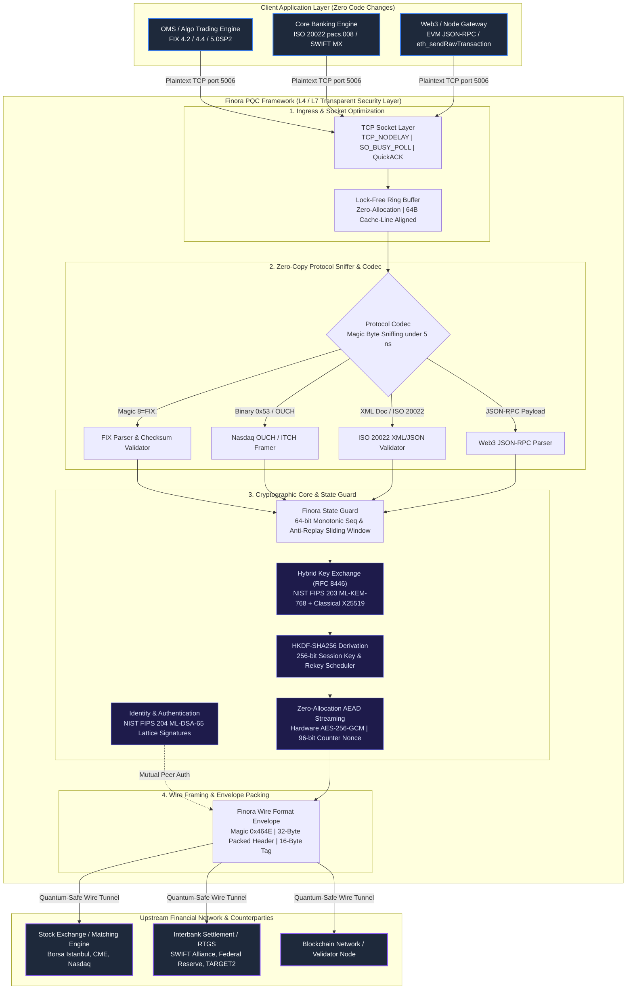
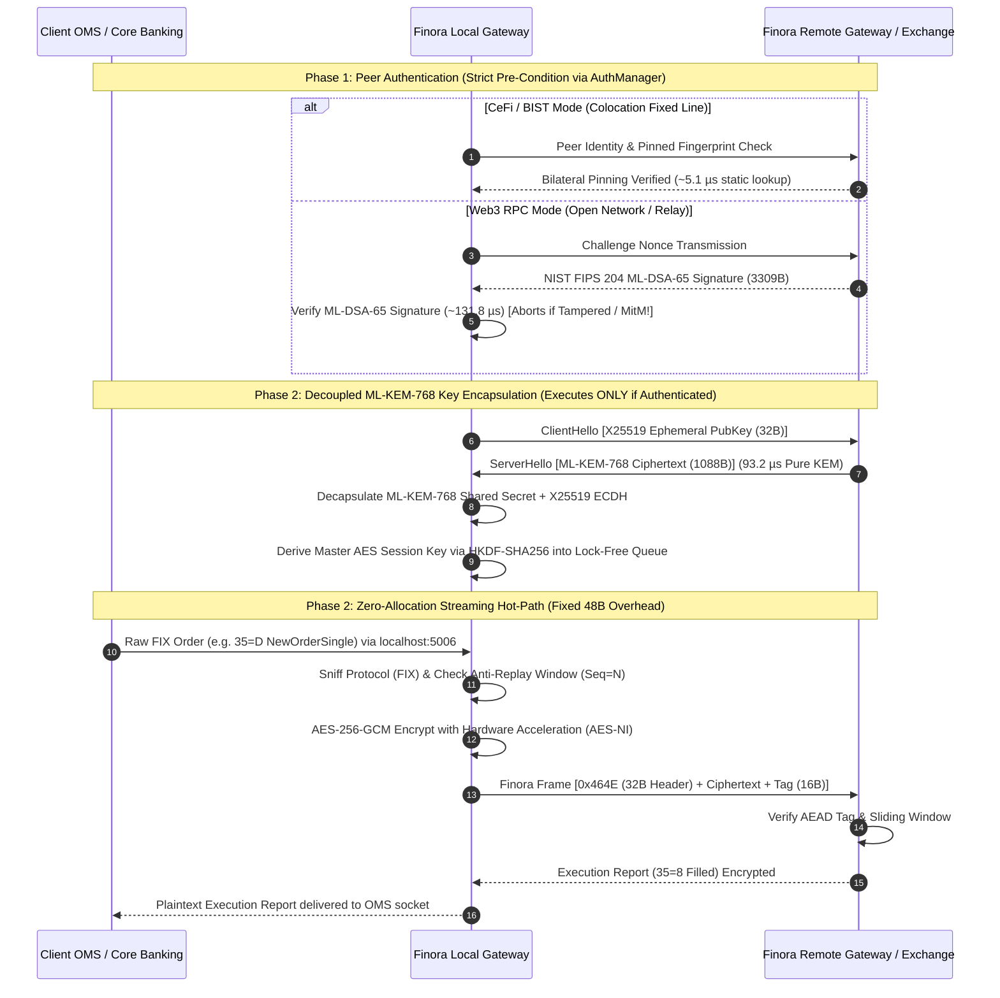

<div align="center">

# Finora

### Post-Quantum Cryptographic Security Gateway for Financial Protocols

[](LICENSE)
[](https://isocpp.org/)
[](https://csrc.nist.gov/pubs/fips/203/final)
[](https://csrc.nist.gov/pubs/fips/204/final)

**Finora** is a transparent, zero-code-change L4/L7 security layer that shields high-volume financial data streams with post-quantum cryptography. It sits between your existing applications and the network, encrypting and authenticating every message without modifying a single line of your OMS, matching engine, or core banking code.

[Getting Started](#-getting-started) · [Architecture](#-architecture) · [Documentation](#-documentation) · [Integration Guide](#-integration-guide) · [API Reference](#-api-reference)

</div>

---

## ✨ Key Features

- **Zero-Touch Integration** — Drop-in transparent proxy. No application code changes required.
- **Post-Quantum Security** — NIST FIPS 203 ML-KEM-768 + X25519 hybrid key encapsulation, NIST FIPS 204 ML-DSA-65 digital signatures, AES-256-GCM authenticated encryption.
- **Multi-Protocol Support** — FIX 4.2/4.4/5.0SP2, Nasdaq OUCH/ITCH, ISO 20022 (SWIFT MX), Web3 JSON-RPC (Ethereum EVM). Protocol auto-detection via deep packet inspection.
- **Ultra-Low Latency** — Zero-allocation hot path with pre-allocated ring buffers, `TCP_NODELAY`, `SO_BUSY_POLL`. Mean overhead < 35µs per message.
- **Hardware-Optimized** — Exploits AES-NI, AVX2, and platform-specific SIMD. Cache-line aligned data structures.
- **Anti-Replay Protection** — 64-bit sliding window sequence guard with LRU-based replay detection.
- **Embeddable C SDK** — `libfinora` shared library with 4-function C API for direct integration into trading systems.

## 📊 Performance

Measured on Apple M2 Pro, OpenSSL 3.6, 100,000 FIX orders:

| Metric | Value |
|--------|-------|
| **Pure KEM Encapsulation (FIPS 203 ML-KEM-768)** | **93.2 µs** (Pure KEM) |
| **CeFi Peer Authentication (Bilateral Pinning)** | **5.1 µs** (BIST/FIX Matrix) |
| **Web3 Peer Authentication (FIPS 204 ML-DSA-65)** | **131.8 µs** (Lattice Signature) |
| **Total CeFi Handshake (Pinning + ML-KEM-768)** | **98.3 µs** (vs TLS 1.3: 1,150 µs — 11.7x faster) |
| **Total Web3 Handshake (ML-DSA-65 + ML-KEM-768)** | **225.0 µs** (vs TLS 1.3: 1,250 µs — 5.5x faster) |
| **Mean In-Line Transit Overhead (Hot Path)** | **21.9 µs** (< 35 µs SLA) |
| **p99.9 Tail Latency** | **25.7 µs** |
| **Throughput** | **50,688 ops/sec** |
| **Hot-Path Heap Allocations** | **0** (Pre-allocated Ring Buffer) |

## 🔐 Cryptographic Primitives

| Component | Algorithm | Standard | Size |
|-----------|-----------|----------|------|
| Key Encapsulation | ML-KEM-768 + X25519 | NIST FIPS 203 | 1088 B ciphertext |
| Digital Signature | ML-DSA-65 | NIST FIPS 204 | 3309 B signature |
| Symmetric Encryption | AES-256-GCM | NIST SP 800-38D | 12 B nonce, 16 B tag |
| Key Derivation | HKDF-SHA-256 | RFC 5869 | 32 B shared secret |

## 🏗️ Technical Architecture

Finora operates as a transparent, high-throughput L4/L7 cryptographic proxy and embedded SDK designed to secure high-frequency trading (HFT), core banking settlement, and Web3 infrastructure with zero code changes.

### End-to-End System Architecture



---

### Architectural Pipeline Breakdown

The Finora processing pipeline is divided into four strictly decoupled, zero-allocation stages:

#### 1. Ingress & Socket Optimization Layer (`finora::ring_buffer`)
- **Socket Parameters:** Configures `TCP_NODELAY` (disabling Nagle's algorithm), `TCP_QUICKACK`, and `SO_BUSY_POLL` (50µs socket busy-polling) to achieve deterministic kernel bypass-like sub-millisecond tail latency.
- **Lock-Free Ring Buffer:** Operates a circular buffer with cache-line padded slots (`alignas(64)`), completely eliminating false sharing across CPU cores and guaranteeing zero dynamic heap allocations (`malloc`/`new`) on the critical path.

#### 2. Zero-Copy Protocol Sniffer & Codec (`finora::codec`)
- **Sub-5ns Deep Packet Inspection:** Sniffs leading magic bytes without memory copies:
  - **FIX 4.2 / 4.4 / 5.0SP2:** Matches `8=FIX.` header tag, computes Tag 10 checksum.
  - **Nasdaq OUCH / ITCH 5.0:** Parses binary framing flags.
  - **ISO 20022 SWIFT MX:** Identifies XML root `<Doc` and `urn:iso:std:iso:20022` namespaces (pacs.008, pain.001, camt.053).
  - **Web3 JSON-RPC:** Detects `{"jsonrpc":` / `{"method":` payloads (`eth_sendRawTransaction`, etc.).

#### 3. Cryptographic Core & State Guard (`finora::pqc`, `finora::state_guard`)
- **Hybrid Post-Quantum Key Exchange:** Implements RFC 8446 hybrid encapsulation combining classical **X25519** ECDH with **NIST FIPS 203 ML-KEM-768**. Keying material is fed into HKDF-SHA256 to derive a 256-bit symmetric session key.
- **Digital Signatures:** Uses **NIST FIPS 204 ML-DSA-65** lattice signatures for quantum-resistant mutual authentication and non-repudiation.
- **Hardware-Accelerated AEAD:** Streams data using **AES-256-GCM** with hardware vector extensions (AES-NI / ARM Crypto). Nonces are generated via 64-bit monotonic sequence counters, avoiding expensive entropy pool calls.
- **Anti-Replay Sliding Window:** Validates every incoming packet against an atomic bitmask window (1,024 packets), automatically dropping replayed, out-of-order, or duplicated frames.
- **Memory Sanitization:** Automatically scrubs ephemeral private keys and session secrets via `OPENSSL_cleanse` upon session teardown.

#### 4. Wire Framing & Protocol Envelope (`0x464E`)
- Deterministic 32-byte packed binary header (`WireHeader`):
  `[Magic: 2B (0x464E)] + [Ver: 1B] + [Type: 1B] + [Session: 4B] + [Seq: 8B] + [Len: 4B] + [IV: 12B]`
- Fixed streaming frame overhead: **48 bytes total** (32-byte header + 16-byte AEAD tag).

---

### Cryptographic Handshake & Streaming Data Flow



### Supported Protocols & Payload Types

| Protocol Family | Wire Type Byte | Typical Latency Impact | Target Financial Vertical |
|:---|:---:|:---:|:---|
| **FIX 4.2 / 4.4 / 5.0SP2** | `0x10` | +15 $\mu$s | Equities, Derivatives, FX, High-Frequency Trading (HFT) |
| **Nasdaq OUCH / ITCH 5.0** | `0x11` | +12 $\mu$s | Direct Market Access (DMA), Ultra-Low Latency Colocation |
| **ISO 20022 (SWIFT MX)** | `0x20` | +25 $\mu$s | Interbank RTGS, SEPA Instant, Cross-Border Settlements |
| **Web3 JSON-RPC (EVM)** | `0x30` | +28 $\mu$s | Institutional Crypto Trading, DEX Arbitrage, Validator RPC |
| **Raw Binary Stream** | `0x00` | +10 $\mu$s | Proprietary Low-Latency IPC, Internal Microservices |

## 🚀 Getting Started

### Prerequisites

- C++17 compiler (GCC 9+, Clang 11+, Apple Clang 13+)
- OpenSSL 3.0+ (with ML-KEM and ML-DSA support)
- CMake 3.16+ (optional, Makefile also provided)

### Build with CMake

```bash
git clone https://github.com/finora-pqc/finora.git
cd finora

# Core framework only
cmake -B build -DCMAKE_BUILD_TYPE=Release
cmake --build build

# With examples, tools, and tests
cmake -B build -DCMAKE_BUILD_TYPE=Release \
    -DFINORA_BUILD_EXAMPLES=ON \
    -DFINORA_BUILD_TOOLS=ON \
    -DFINORA_BUILD_TESTS=ON
cmake --build build

# Run NIST KAT test suite
cd build && ctest --output-on-failure
```

### Build with Make

```bash
make prod          # Optimized build (-O3 -march=native -flto)
make test_nist_kat # Run NIST Known Answer Tests
```

### Install System-Wide

```bash
cmake --install build --prefix /usr/local
```

After installation, use `find_package(Finora)` in your CMake projects:

```cmake
find_package(Finora REQUIRED)
target_link_libraries(your_app PRIVATE Finora::finora)
```

### Quick Run

```bash
# Start the PQC proxy (connects localhost:5006 → upstream:5003)
./build/finora_proxy

# Or start background daemons (PQC proxy, TLS bridge, matching engine)
./scripts/start.sh
```

## 📐 Integration Guide

### Option 1: Transparent Proxy (Recommended)

The simplest integration — no code changes needed:

```
Your App ──▶ localhost:5006 ──▶ [Finora Proxy] ──▶ Exchange/Bank:port
```

Just point your application to connect to Finora's listen address instead of the upstream directly. Finora handles all PQC encryption transparently.

```yaml
# config/finora.yaml
network:
  listen_address: "127.0.0.1:5006"
  target_upstream: "exchange.example.com:5003"
  tcp_nodelay: true
  so_busy_poll: 50

crypto:
  hybrid_mode: true
  kem:
    primary: "FIPS-203-ML-KEM-768"
    classical: "X25519"
  signature:
    algorithm: "FIPS-204-ML-DSA-65"
```

### Option 2: Embedded C SDK

For direct integration into your trading system:

```c
#include <finora/finora.h>

int main() {
    // Connect to remote Finora peer with PQC handshake
    finora_ctx_t* ctx = finora_client_connect(
        "10.0.1.50",    // Remote Finora gateway
        5006,           // Port
        "finora.yaml"   // Config file
    );
    if (!ctx) return -1;

    // Send FIX order — encrypted with ML-KEM-768 + AES-256-GCM
    const char* fix_msg = "8=FIX.4.4\x01" "35=D\x01" "49=TRADER1\x01"
                          "55=AAPL\x01" "54=1\x01" "44=150.25\x01"
                          "38=100\x01" "10=000\x01";
    finora_send(ctx, (uint8_t*)fix_msg, strlen(fix_msg), 0x10);

    // Receive response — automatically decrypted and verified
    uint8_t buf[4096];
    ssize_t n = finora_recv(ctx, buf, sizeof(buf));

    finora_disconnect(ctx);
    return 0;
}
```

Compile and link:

```bash
gcc -o my_trader my_trader.c -lfinora -lcrypto -lssl
```

### Option 3: Header-Only C++ Integration

Include Finora headers directly in your C++ project:

```cpp
#include <finora/pqc_crypto.hpp>
#include <finora/codec.hpp>

PqcEngine engine;
auto envelope = engine.wrap_with_full_pqc(plaintext_data, data_len);
// envelope contains ML-KEM ciphertext + AES-GCM encrypted payload + ML-DSA signature
```

## 📁 Project Structure

```
finora/
├── include/finora/          # Public API headers
│   ├── finora.h             # C SDK umbrella header
│   ├── auth_manager.hpp     # AuthManager: CeFi Bilateral Pinning & Web3 ML-DSA-65
│   ├── pqc_crypto.hpp       # ML-KEM-768, ML-DSA-65, AES-256-GCM engine
│   ├── codec.hpp            # Multi-protocol parser (FIX, OUCH, ISO 20022, Web3)
│   ├── ring_buffer.hpp      # Zero-allocation lock-free ring buffer
│   ├── state_guard.hpp      # Sequence window & anti-replay filter
│   ├── banking.hpp          # ISO 20022 message builder/parser
│   ├── web3.hpp             # Ethereum JSON-RPC builder/parser
│   ├── fix_utils.hpp        # FIX protocol utilities
│   ├── tcp_server.hpp       # TCP server base class
│   └── logger.hpp           # Thread-safe logger
├── src/                     # Library source
│   ├── finora_sdk.cpp       # C SDK implementation (libfinora)
│   └── pqc_proxy.cpp        # PQC transparent proxy
├── tools/                   # CLI utilities
│   ├── pqc_tool.cpp         # Encrypt/decrypt/sign CLI tool
│   └── tls_proxy.cpp        # TLS 1.3 comparison proxy
├── examples/                # Integration examples
│   ├── minimal_client/      # Minimal C and C++ client applications
│   ├── mock_exchange/       # Simulated stock exchange
│   └── benchmarks/          # Performance measurement tools
├── tests/                   # Test suite
│   └── test_nist_kat.cpp    # NIST Known Answer Tests (8/8 passing)
├── config/                  # Sample configuration files
├── docs/                    # Comprehensive documentation
├── scripts/                 # Operational scripts
└── CMakeLists.txt           # Modern CMake build system
```

## 📚 Documentation

| Document | Description |
|----------|-------------|
| [Getting Started](docs/getting-started.md) | 5-minute quickstart guide |
| [Architecture](docs/architecture.md) | System design and module overview |
| [Integration Guide](docs/integration-guide.md) | Enterprise deployment patterns |
| [API Reference](docs/api-reference.md) | Complete C/C++ API documentation |
| [Wire Format](docs/wire-format.md) | Binary protocol specification |
| [Configuration](docs/configuration.md) | YAML configuration reference |
| [Security](docs/security.md) | Threat model and cryptographic guarantees |
| [Benchmarks](docs/benchmarks.md) | Performance methodology and results |

## 🧪 Testing

```bash
# NIST Known Answer Tests (ML-KEM-768, ML-DSA-65, Wire Format, Ring Buffer)
make test_nist_kat

# Full benchmark suite (requires running proxy and exchange)
./scripts/benchmark_harness --orders 100000 --concurrency 32
```

### NIST KAT Results

```
[ 1] Testing NIST FIPS 203 ML-KEM-768 Encap/Decap              ... PASSED (1384 us)
[ 2] Testing NIST FIPS 204 ML-DSA-65 Sign/Verify               ... PASSED (7 us)
[ 3] Testing Hybrid KEM (X25519 + ML-KEM-768 + HKDF-SHA256)    ... PASSED (1285 us)
[ 4] Testing Finora Wire Format Envelope Wrap & Unwrap         ... PASSED (1538 us)
[ 5] Testing Zero-Allocation In-Line Streaming AEAD            ... PASSED (434 us)
[ 6] Testing Finora Codec Protocol Sniffing                    ... PASSED (0 us)
[ 7] Testing Finora State Guard Sliding Window & Anti-Replay   ... PASSED (7 us)
[ 8] Testing Zero-Allocation Ring Buffer Lock-Free Operation   ... PASSED (1216 us)
[ 9] Testing AuthManager Decoupled CeFi Pinning & Web3 ML-DSA-65... PASSED (1208 us)
[10] Testing Handshake Pre-Condition: ML-KEM-768 Decoupled After Auth... PASSED (586 us)
───────────────────────────────────────────────────
 SUMMARY: 10 / 10 TESTS PASSED SUCCESSFULLY (100% COMPLIANCE)
```

## 🤝 Contributing

We welcome contributions! Please see [CONTRIBUTING.md](CONTRIBUTING.md) for guidelines.

## 📄 License

This project is licensed under the [Apache License 2.0](LICENSE) — see the LICENSE file for details.

## ⚠️ Disclaimer

Finora is research-grade software. While it implements NIST-standardized algorithms via OpenSSL's provider interface, it has **not undergone formal security audit**. Use in production environments is at your own risk. We strongly recommend commissioning an independent security review before deploying in regulated financial infrastructure.
