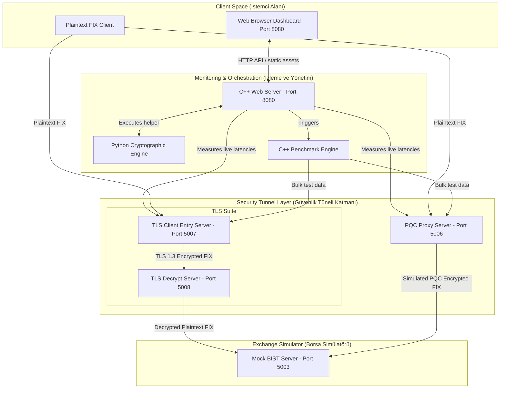
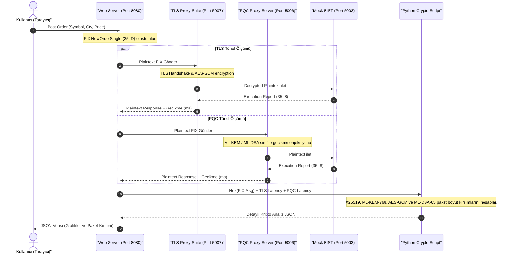

# FIX-Q Projesi - Genel Mimari Dökümanı

Bu döküman, **FIX-Q (Finora Quantum-Safe HFT Terminal)** projesinin genel sistem mimarisini, veri akışını, entegrasyon şemalarını ve kullanılan teknolojileri kapsamaktadır.

---

## 1. Özet Paragrafı
**FIX-Q**, Yüksek Frekanslı İşlem (HFT) sistemlerinde yaygın olarak kullanılan **FIX (Financial Information eXchange)** protokolü trafiğinin, kuantum bilgisayarların yaratacağı tehditlere karşı **Kuantum Sonrası Şifreleme (PQC - Post-Quantum Cryptography)** yöntemleriyle korunmasını simüle eden ve analiz eden hibrit bir güvenlik platformudur. Proje, klasik **TLS 1.3** protokolü ile FIPS-203/204 standartlarında yer alan hibrit PQC (ML-KEM-768 ve ML-DSA-65) tünelleme yaklaşımlarını eşzamanlı olarak çalıştırarak; şifreleme gecikmeleri (latency), CPU döngüleri (CPU cycles) ve ağ paket parçalanması (fragmentation) parametreleri üzerinden mikro saniye hassasiyetinde bir performans karşılaştırması sunar.

---

## 2. Mimari Şeması
Aşağıdaki diyagram, FIX-Q projesinin bileşenlerini ve veri yollarını göstermektedir:

---

## 3. Akış Şeması
Aşağıdaki akış şeması, sisteme gönderilen manuel bir emrin şifrelenmesi, iletilmesi, işlenmesi ve geri dönen yanıtın analiz edilerek kullanıcı arayüzüne yansıtılma sürecini göstermektedir:

---

## 4. Kullanılan Teknolojiler
Projenin genelinde kullanılan temel teknolojiler ve kütüphaneler şunlardır:

*   **C++17**: Performans kritik proxy motorları, eşleştirme motoru ve web sunucusunun geliştirilmesinde kullanılmıştır. Low-latency HFT optimizasyonları için tercih edilmiştir.
*   **Python 3**: Kuantum sonrası kriptografi simülasyonu, veri analitiği, paket parçalanma hesaplamaları ve FIX test verisi üretimi amacıyla kullanılmıştır.
*   **OpenSSL (v3.x)**: TLS tünelleme katmanında SSL/TLS el sıkışması ve PQC tünelindeki gerçek simetrik şifreleme işlemlerinde (AES-256-GCM) kullanılan temel kriptografi kütüphanesidir.
*   **Mermaid.js**: Mimarilerin ve akış şemalarının görselleştirilmesinde kullanılan diyagram aracıdır.
*   **POSIX Sockets**: Yüksek performanslı TCP bağlantı yönetimi için kullanılmıştır.
