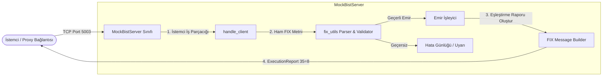

# FIX-Q - Mock BIST Eşleştirme Motoru Dökümanı

Bu döküman, **Mock BIST (Borsa İstanbul) Server** bileşeninin detaylı analizini, iç mimarisini, akış süreçlerini ve kullanılan teknolojileri açıklar.

---

## 1. Özet Paragrafı
**Mock BIST Server** (`src/mock_bist.cpp`), Borsa İstanbul veya herhangi bir finansal borsanın FIX protokolü arayüzünü simüle eden, hafif ve ultra düşük gecikmeli bir C++ TCP sunucusudur. `5003` numaralı port üzerinde çalışır ve TCP sunucu altyapısı olarak `tcp_server.hpp` sınıf şablonunu miras alır. Sunucu, istemcilerden veya ara sunucu (proxy) tünellerinden gelen ham FIX (Financial Information eXchange) iletilerini SOH (`\x01`) sınırlayıcılarına göre işler. Gelen iletilerin yapısal bütünlüğünü (BeginString, BodyLength, Checksum) doğruladıktan sonra, eğer ileti bir "Yeni Limit Emir" (`NewOrderSingle`, `35=D`) ise, bunu anında eşleştirilmiş (Filled) kabul eder ve standartlara uygun bir "Gerçekleşme Raporu" (`ExecutionReport`, `35=8`) üreterek aynı TCP bağlantısı üzerinden istemciye geri döner.

---

## 2. Mimari Şeması
Aşağıdaki şema, Mock BIST sunucusunun iç yapısını ve diğer modüllerle ilişkisini göstermektedir:



---

## 3. Akış Şeması
Mock BIST sunucusunun her bir istemci bağlantısı için izlediği çalışma akışı aşağıdaki gibidir:

```mermaid
flowchart TD
    Start([Mock BIST Sunucusu Başlatıldı - Port 5003]) --> Init[Soket Ayarları: SO_REUSEADDR ve TCP_NODELAY]
    Init --> Listen[Port Dinleme & Bağlantı Bekleme]
    Listen --> Accept{Yeni Bağlantı Geldi mi?}
    Accept -- Evet --> Thread[Ayrı bir Thread Başlat handle_client]
    Accept -- Hayır --> Listen
    
    subgraph ClientLoop ["İstemci İletişim Döngüsü (handle_client)"]
        Thread --> Read[Soketten Veri Oku - buffer 4096B]
        Read --> CheckRead{Veri Okundu mu?}
        CheckRead -- Bağlantı Koptu / Hata --> Close[Bağlantıyı Kapat & Thread Sonlandır]
        CheckRead -- Evet --> ConvertSOH[Borulardan '|' SOH '\x01' Karakterine Dönüştür]
        
        ConvertSOH --> Validate[FIX İletisini Doğrula BeginString, BodyLength, Checksum]
        Validate --> IsValid{İleti Geçerli mi?}
        
        IsValid -- Hayır --> LogWarn[Uyarısı Günlüğe Yaz] --> Read
        IsValid -- Evet --> CheckMsgType{MsgType 35 == 'D' mi?}
        
        CheckMsgType -- Hayır --> Read
        CheckMsgType -- Evet --> ParseFields[Tag Değerlerini Oku: ClOrdID, Symbol, Side, Qty, Price]
        ParseFields --> GenIDs[Benzersiz ExecID ve OrderID Oluştur]
        GenIDs --> BuildExecReport[ExecutionReport İletisini İnşa Et 35=8, 150=2 Filled, 39=2 Filled]
        BuildExecReport --> Send[Sokete ExecutionReport Yaz]
        Send --> Read
    end
```

---

## 4. Kullanılan Teknolojiler
Mock BIST Server bileşeninde kullanılan temel teknoloji ve standartlar şunlardır:

*   **C++17**: POSIX soket yönetimi ve nesne yönelimli TCP sunucu yapısı için ana dil olarak kullanılmıştır.
*   **POSIX Sockets API**: Sunucu soketinin oluşturulması (`socket`), adrese bağlanması (`bind`), dinlemesi (`listen`), kabul etmesi (`accept`) ve veri alışverişi (`read`/`write`) için doğrudan işletim sistemi API'leri kullanılmıştır.
*   **TCP_NODELAY**: Alt seviye soket seçeneği etkinleştirilerek Nagle algoritması devre dışı bırakılmış, böylece küçük FIX paketlerinin tamponlanmadan anında gönderilmesi (low-latency) sağlanmıştır.
*   **C++11 Multi-threading**: Sunucuya aynı anda bağlanan birden fazla istemciyi asenkron olarak yönetmek amacıyla, her yeni bağlantı için `std::thread` nesnesi oluşturulup `detach` edilmiştir.
*   **FIX 4.4 Protokol Standartları**: Finansal iletilerin standardizasyonu için `35=D` (New Order Single), `35=8` (Execution Report), `150=2` (ExecType: Filled) ve `39=2` (OrdStatus: Filled) protokol tanımları kullanılmıştır.
