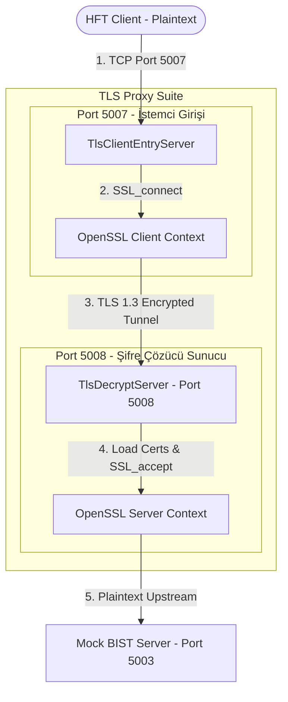
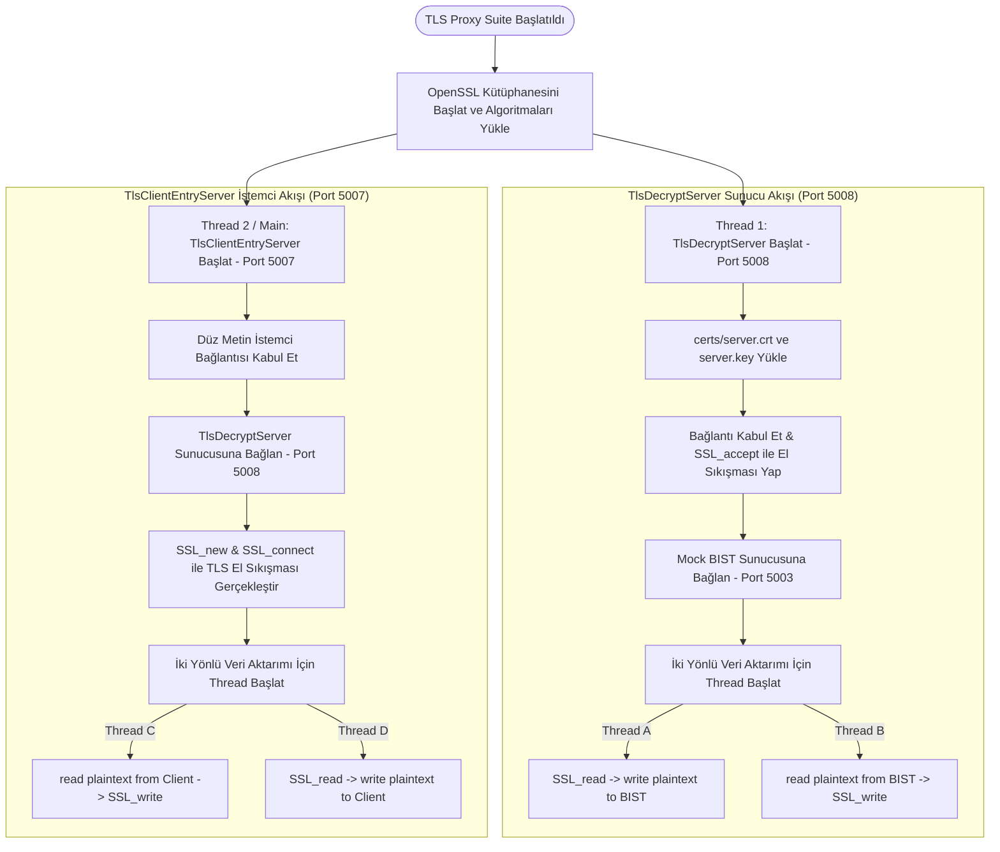

# FIX-Q - TLS 1.3 Proxy Tüneli Dökümanı

Bu döküman, **TLS 1.3 Proxy Suite** bileşeninin detaylı analizini, iç mimarisini, akış süreçlerini ve kullanılan teknolojilerini açıklar.

---

## 1. Özet Paragrafı
**TLS 1.3 Proxy Suite** (`src/tls_proxy.cpp`), klasik finansal altyapılarda kullanılan güvenli haberleşme standardı **TLS 1.3** tünellemesini gerçekleştiren, yüksek performanslı ve çift taraflı çalışan bir C++ sunucu uygulamasıdır. Tek bir çalıştırılabilir dosya içinde iki farklı TCP sunucusu barındırır:
1.  **TlsClientEntryServer** (`Port 5007`): İstemcilerden gelen yerel düz metin (plaintext) FIX bağlantılarını kabul eder ve bunları OpenSSL istemcisi olarak TLS el sıkışmasıyla port 5008'deki sunucuya tüneller.
2.  **TlsDecryptServer** (`Port 5008`): Port 5007'den gelen TLS şifreli verileri yakalar, `certs/server.crt` ve `certs/server.key` dosyaları yardımıyla deşifre eder (decrypt) ve düz metin FIX verisini doğrudan Mock BIST sunucusuna (`Port 5003`) iletir.

Bu yapı sayesinde, normalde TLS desteklemeyen düz metin HFT istemcilerinin ağ üzerinden TLS 1.3 ile şifrelenmiş olarak haberleşmesi ve hedefe ulaşmadan önce şifrelerinin güvenle çözülmesi simüle edilmiş olur.

---

## 2. Mimari Şeması
Aşağıdaki şema, TLS Proxy Suite'in çift taraflı tünelleme mimarisini ve veri akış yönünü göstermektedir:

---

## 3. Akış Şeması
TLS Proxy Suite'in başlatılması ve bir emrin çift yönlü aktarılma süreci aşağıdaki akış şemasında gösterilmiştir:

---

## 4. Kullanılan Teknolojiler
TLS 1.3 Proxy Suite bileşeninde kullanılan temel teknoloji ve kütüphaneler şunlardır:

*   **C++17 ve POSIX Sockets**: Sunucunun ağ iletişimi ve yüksek performanslı tampon yönetimi için kullanılmıştır.
*   **OpenSSL (libssl & libcrypto)**: Klasik şifreleme, TLS el sıkışma yönetimi, sertifika doğrulama (veya bu senaryoda localhost bypass) ve TLS 1.3 kaydı şifreleme/deşifreleme işlemleri için ana kütüphanedir.
*   **PEM Sertifikaları**: Sunucu kimlik doğrulaması için `certs/server.crt` (X.509 formatında sertifika) ve `certs/server.key` (RSA/ECC Özel Anahtarı) kullanılmıştır.
*   **C++ std::thread**: Hem iki farklı sunucuyu paralel çalıştırmak hem de her bağlantı için soketler arası veri kopyalama işlemlerini (`proxy_plain_to_tls` ve `proxy_tls_to_plain`) asenkron olarak yürütmek için kullanılmıştır.
*   **TCP_NODELAY**: Paketlerin ağda birikmesini önlemek ve TLS tünelindeki HFT gecikmelerini en aza indirmek için soket seviyesinde ayarlanmıştır.
