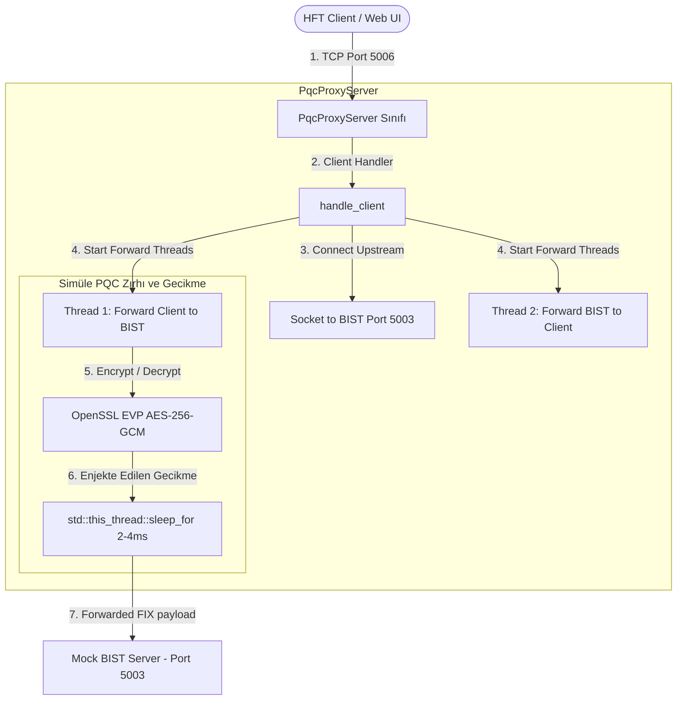
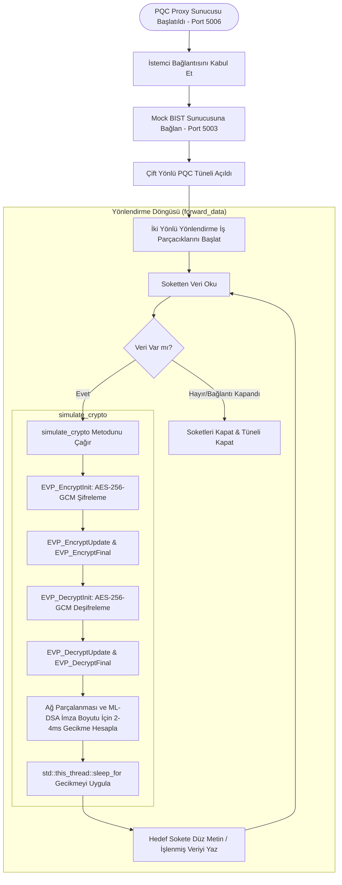

# FIX-Q - C++ PQC Proxy ve Ağ Simülatörü Dökümanı

Bu döküman, **C++ PQC Proxy Server** bileşeninin detaylı analizini, iç mimarisini, akış süreçlerini ve kullanılan teknolojilerini açıklar.

---

## 1. Özet Paragrafı
**C++ PQC Proxy Server** (`src/pqc_proxy.cpp`), kuantum tehditlerine karşı geliştirilen koruma katmanının HFT ağlarındaki gerçekçi davranışını simüle eden, `Port 5006` üzerinde çalışan bir TCP tünel sunucusudur. İstemciden gelen bağlantıları kabul ettikten sonra Mock BIST sunucusuna (`Port 5003`) bir üst akış (upstream) bağlantısı kurar ve aradaki veri iletimini asenkron olarak yürütür. Proksinin en kritik görevi, kuantum sonrası şifreleme algoritmalarının (özellikle FIPS-204 standardı ML-DSA-65 imza şeması) ürettiği büyük boyutlu paketlerin (3.3 KB imza boyutu) Ethernet MTU sınırını aşması sonucu oluşan **ağ parçalanması (network fragmentation)** ve iletim gecikmesini simüle etmektir. Bunun için OpenSSL EVP API'si ile gerçekçi bir AES-256-GCM şifreleme/deşifreleme süreci işletir ve tünelden geçen her mesaja **2 ila 4 milisaniye** arasında rastgele seçilen mikro saniye hassasiyetli bir ağ gecikmesi enjekte eder.

---

## 2. Mimari Şeması
Aşağıdaki şema, PQC Proxy Server'ın bileşen seviyesindeki mimarisini ve BIST simülatörüyle olan ilişkisini gösterir:

---

## 3. Akış Şeması
PQC Proxy Server üzerinden verinin akış ve gecikme simülasyonu adımları aşağıdaki gibidir:

---

## 4. Kullanılan Teknolojiler
C++ PQC Proxy Server bileşeninde kullanılan temel teknoloji ve standartlar şunlardır:

*   **C++17**: POSIX soket yönetimi ve nesne yönelimli TCP sunucu yapısı için ana dil olarak kullanılmıştır.
*   **OpenSSL EVP API**: AES-256-GCM gibi yüksek güvenlikli simetrik şifreleme algoritmalarını donanım ivmeli (AES-NI) ve güvenli bir şekilde çalıştırmak amacıyla kullanılmıştır.
*   **C++ std::chrono & std::this_thread**: Simüle edilen kuantum sonrası imza paket gecikmelerini (2-4 ms aralığında mikro saniye hassasiyetli gecikmeler) enjekte etmek amacıyla kullanılmıştır.
*   **POSIX Sockets**: Yüksek performanslı TCP veri iletimi ve çift yönlü soket kapatma işlemleri (`shutdown(fd, SHUT_RD/WR)`) için kullanılmıştır.
*   **FIPS 203/204 Boyut Modellemesi**: ML-KEM ve ML-DSA algoritmalarının paket büyüklükleri ve ağ üzerindeki olası TCP paket bölünmesi etkileri gecikme parametrelerinin temelini oluşturmaktadır.
