# FIX-Q - Kriptografik PQC Tünel Motoru Dökümanı

Bu döküman, **Python Cryptographic PQC Tunnel & Dissection Engine** (`crypto/pqc_tunnel.py` ve `crypto/encrypt_order.py`) bileşeninin detaylı analizini, iç mimarisini, akış süreçlerini ve kullanılan teknolojilerini açıklar.

---

## 1. Özet Paragrafı
**Kriptografik PQC Tünel Motoru**, kuantum sonrası hibrit şifreleme tünelinin paket yapısını, veri boyutlarını ve kriptografik katmanlarını birebir modelleyen Python tabanlı bir yazılım motorudur. Projenin web arayüzündeki **Kriptografik Kablo İnceleyici (Wire Inspector)** bölümüne veri sağlamak amacıyla geliştirilmiştir. Motor; anahtar değişimi için **X25519** (32 byte) ile **ML-KEM-768** (1088 byte şifreli metin), simetrik şifreleme için **AES-256-GCM** (12 byte nonce + 16 byte yetkilendirme etiketi) ve kimlik doğrulama/imza için **ML-DSA-65** (3309 byte imza) algoritmalarını birleştirerek hibrit bir PQC koruma kalkanı simüle eder. Gerçek AES-256-GCM şifrelemesi ve HMAC-SHA512 tabanlı boyut-doğrulanmış ML-DSA imzası kullanarak hem boyutsal hem de işlevsel açıdan FIPS 203 ve FIPS 204 standartlarıyla tam uyumlu bir ikili kablo (binary wire) formatı oluşturur ve çözümler.

---

## 2. Mimari Şeması
Aşağıdaki şema, PQC Tünelinin kablo paket yapısını (Wire Format) ve katmanlarının bayt cinsinden boyutlarını göstermektedir:

```
┌────────────────────────────────────────────────────────────────────────────────────────┐
│ PQC Tüneli İkili Kablo Paketi (Wire Packet Structure)                                  │
├──────────────────┬───────────────────┬────────────────┬───────────────────┬────────────┤
│ X25519 Key (32B) │ ML-KEM-768 (1088B)│ AES Nonce (12B)│ AES Cipher+Tag    │ ML-DSA-65  │
│ Classical ECDH   │ FIPS 203 KEM CT   │ Symmetric IV   │ (Veri Boyutu+16B) │ Sig (3309B)│
└──────────────────┴───────────────────┴────────────────┴───────────────────┴────────────┘
│◄──────────────────────────────── Signed Payload ────────────────────────────────►│ (ML-DSA)
                                                                    ┌────────────┐
                                                                    │ Plaintext  │
                                                                    │ Len (4B)   │
                                                                    └────────────┘
                                                                    (Big-Endian)
```

### Katmanlar ve Boyut Tablosu:
| Katman Adı | Kullanılan Algoritma | Boyut (Byte) | Görevi |
| :--- | :--- | :--- | :--- |
| **Key Exchange (Klasik)** | X25519 | 32 | Klasik eliptik eğri anahtar paylaşımı (hibrit yapı için). |
| **Key Exchange (Kuantum)** | ML-KEM-768 | 1088 | Kuantum güvenli anahtar kapsülleme (Ciphertext). |
| **Symmetric Nonce** | AES-GCM IV | 12 | Simetrik şifreleme için benzersiz başlatma vektörü. |
| **Encrypted Payload** | AES-256-GCM | Değişken + 16 | Şifrelenmiş FIX iletisi + 16 byte GCM Yetkilendirme Etiketi. |
| **Digital Signature** | ML-DSA-65 | 3309 | Kuantum güvenli dijital imza (bütünlük ve kimlik doğrulama). |
| **Plaintext Length** | Big-Endian uint32 | 4 | Orijinal verinin çözüldükten sonraki boyut bilgisi. |

---

## 3. Akış Şeması
Aşağıdaki akış şeması, istemciden gönderilen emrin PQC tünel paketi haline getirilmesi (`process_outgoing`) ve alıcı tarafta çözülmesi (`process_incoming`) adımlarını göstermektedir:

```mermaid
flowchart TD
    subgraph OutgoingProcess ["process_outgoing (Paketleme)"]
        A[Ham FIX Verisi] --> B[X25519 Ephemeral Key Üret - 32B]
        B --> C[ML-KEM-768 Encapsulate Et - 1088B KEM CT]
        C --> D[AES-256-GCM ile Ham Veriyi Şifrele - Nonce 12B + Ciphertext]
        D --> E[İmzalanacak Gövdeyi Birleştir: X25519 + KEM + AES]
        E --> F[ML-DSA-65 Simüle İmzası Üret - HMAC-SHA512 + 3245B Pad]
        F --> G[Kablo Paketini İnşa Et: Gövde + İmza + Plaintext Boyutu 4B]
        G --> H([PQC Wire Packet])
    end

    subgraph IncomingProcess ["process_incoming (Paket Açma)"]
        I([PQC Wire Packet]) --> J[Son 4 Byte'tan Plaintext Boyutunu Oku]
        J --> K[İmza Bölümünü Ayır - Son 4B öncesindeki 3309B]
        K --> L[İmzalanmış Gövdeyi Ayır]
        L --> M[ML-DSA-65 İmzayı Doğrula - HMAC-SHA512 Karşılaştır]
        M -->|Başarısız| N[Hata: Signature Verification Failed]
        M -->|Başarılı| O[Gövdeden AES Nonce ve Ciphertext'i Ayrıştır]
        O --> P[AES-256-GCM ile Verinin Şifresini Çöz]
        P --> Q[Orijinal Ham FIX Verisi]
    end
```



---

## 4. Kullanılan Teknolojiler
Kriptografik PQC Tünel Motoru bileşeninde kullanılan temel teknoloji ve kütüphaneler şunlardır:

*   **Python 3**: Veri analizi ve paket yapılandırma işlemleri için ana platformdur.
*   **cryptography (Python Kütüphanesi)**: Gerçek AES-256-GCM şifreleme süreçlerini yürütmek için `cryptography.hazmat.primitives.ciphers.aead.AESGCM` sınıfı kullanılmıştır.
*   **struct (Standart Kütüphane)**: Plaintext boyutu gibi başlık bilgilerini büyük sonlu (big-endian) ikili biçimde paketlemek (`struct.pack('>I', ...)`) ve çözmek için kullanılmıştır.
*   **hmac & hashlib**: ML-DSA-65 imza doğrulamasını simüle etmek için yüksek hızlı HMAC-SHA512 algoritması kullanılmıştır.
*   **PyYAML**: Kripto-agil ayarlarını içeren `config/crypto.yaml` dosyasını okumak için kullanılmıştır.
