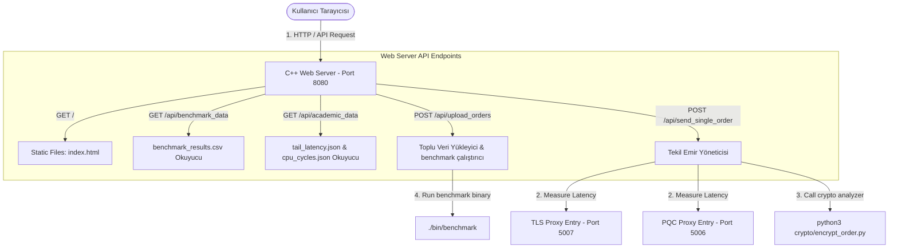
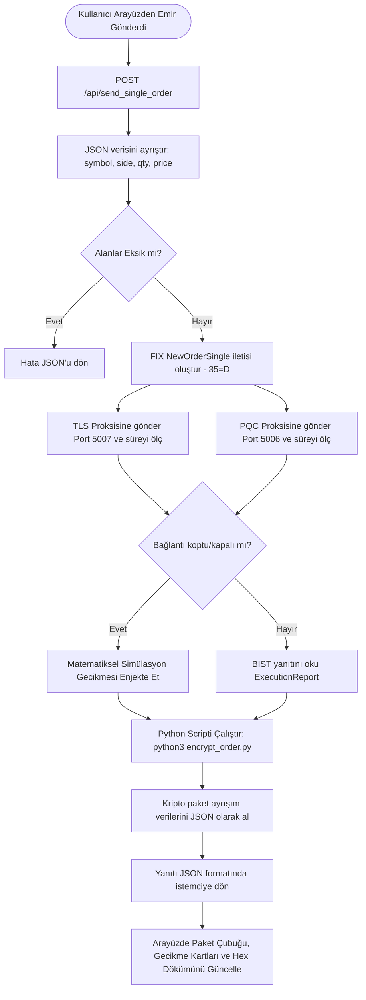

# FIX-Q - Web Sunucusu ve Dashboard Arayüzü Dökümanı

Bu döküman, **C++ Web Server** ve **HTML5/JS Dashboard Arayüzü** bileşenlerinin detaylı analizini, iç mimarisini, akış süreçlerini ve kullanılan teknolojilerini açıklar.

---

## 1. Özet Paragrafı
**Web Sunucusu ve Dashboard Arayüzü**, FIX-Q platformunun yönetim merkezini ve kullanıcı etkileşim katmanını oluşturur. Backend, tek bir header'dan oluşan hafif `httplib.h` kütüphanesi üzerine kurulu bir C++ web sunucusudur ve `Port 8080` üzerinde çalışır. Statik web dosyalarını (`ui/static/index.html`) doğrudan istemciye sunmanın yanı sıra; proksilerden veri toplayan, toplu testleri başlatan ve kriptografik analiz komutlarını (`encrypt_order.py`) tetikleyen REST API uç noktaları (endpoints) barındırır. Tarayıcı tarafında çalışan arayüz ise; modern **Outfit** ve **JetBrains Mono** fontları ile tasarlanmış, tek sayfalık (SPA) premium bir terminal arayüzüdür. Kullanıcılar bu arayüz üzerinden manuel emirler gönderebilir, bu emirlerin TLS ve PQC proksileri üzerindeki anlık gecikmelerini ölçebilir, kablo üzerindeki (on-the-wire) paket yapısının bayt bayt görsel dökümünü inceleyebilir ve Klasik Bilgisayar (Normal PC) ile Kuantum Bilgisayarı (Quantum PC) kırma sürelerini ve kuantum güvenlik risklerini kıyaslayabilirler.

---

## 2. Mimari Şeması
Aşağıdaki şema, Web Sunucusu ile diğer sistem bileşenleri ve istemci tarayıcısı arasındaki veri yollarını göstermektedir:

---

## 3. Akış Şeması
Aşağıdaki akış şeması, kullanıcının tek bir emri manuel gönderdiğinde arka planda çalışan API akışını göstermektedir:

---

## 4. Kullanılan Teknolojiler
Web Sunucusu ve Dashboard Arayüzü bileşeninde kullanılan temel teknoloji ve standartlar şunlardır:

*   **C++17 ve httplib.h**: Sıfır bağımlılıklı, yüksek performanslı ve multithreaded HTTP API backend sunucusu oluşturmak için kullanılmıştır.
*   **HTML5 & CSS3**: Glassmorphism (arka plan bulanıklığı), CSS değişkenleri yardımıyla dinamik renk paletleri ve akıcı geçiş animasyonları içeren modern bir dashboard tasarımı için kullanılmıştır.
*   **JavaScript (ES6+)**: Sayfa yenilenmeden asenkron API istekleri (fetch API), dosya yükleme yönetimi (drag and drop) ve DOM manipülasyonları gerçekleştirmek için kullanılmıştır.
*   **Chart.js**: Gecikme grafiklerini, CDF eğrilerini ve CPU döngü kıyaslamalarını dinamik ve etkileşimli olarak çizdirmek için tarayıcı tarafında kullanılmıştır.
*   **popen & Process Piping**: Web sunucusunun işletim sistemi seviyesinde Python şifreleme betiğini ve C++ benchmark uygulamalarını alt süreç (sub-process) olarak çalıştırıp çıktılarını yakalaması için kullanılmıştır.
