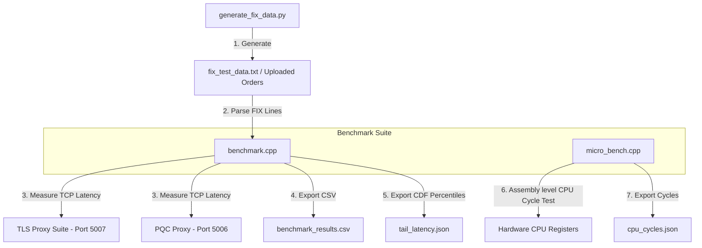
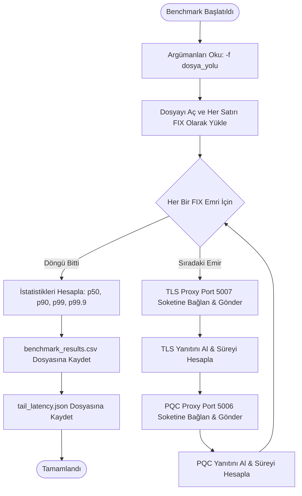
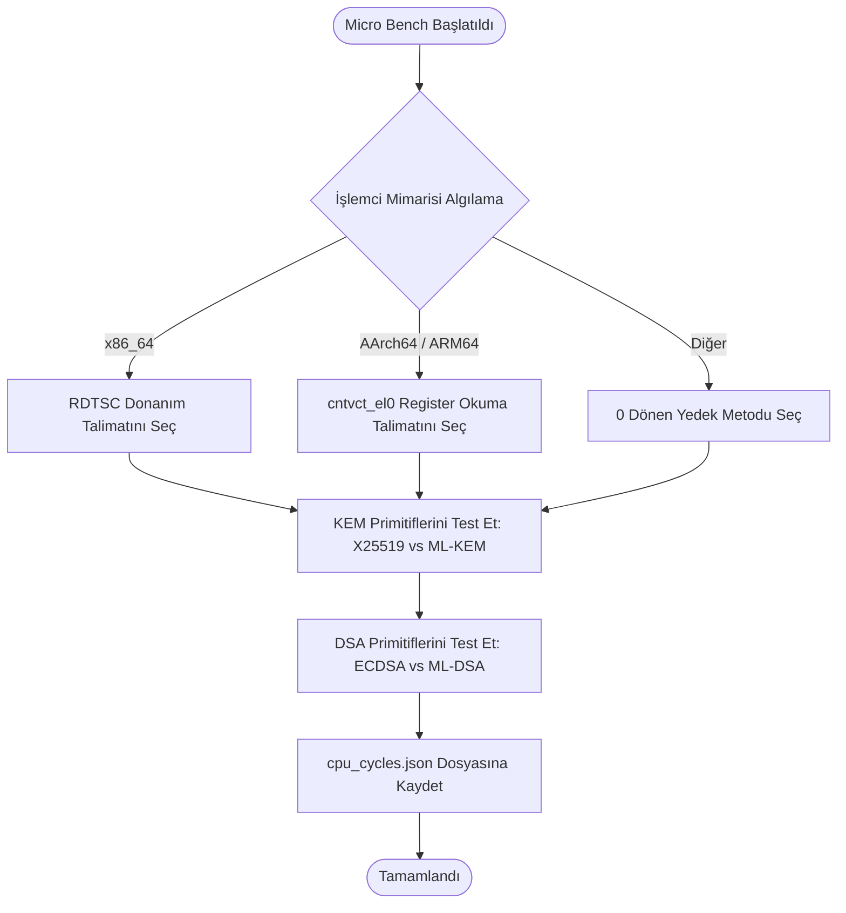

# FIX-Q - Performans Test ve Benchmark Araçları Dökümanı

Bu döküman, **Benchmark Engine** (`src/benchmark.cpp`), **Micro Benchmarking Tool** (`src/micro_bench.cpp`), ve **Test Veri Üreteci** (`generate_fix_data.py`) bileşenlerinin detaylı analizini, iç mimarisini, akış süreçlerini ve kullanılan teknolojilerini açıklar.

---

## 1. Özet Paragrafı
**Performans Test ve Benchmark Araçları**, FIX-Q platformunun kuantum sonrası ve klasik şifreleme altındaki gecikme parametrelerini mikro saniye hassasiyetinde ölçen ve bilimsel veri toplayan analiz araçları bütünüdür. C++ tabanlı **Benchmark Engine**, binlerce FIX emrini içeren veri setlerini okuyup, her bir emri ardışık olarak TLS (`Port 5007`) ve PQC (`Port 5006`) proksilerine göndererek gerçek ağ latanslarını ölçer. Bu verilerden p50 (Medyan), p90, p99 ve p99.9 (Kuyruk Latansı/Tail Latency) yüzdelik dilimlerini hesaplayıp kümülatif dağılım fonksiyonu (CDF) grafiklerini besler. Diğer bir araç olan **Micro Benchmarking Tool** ise donanım seviyesinde CPU döngü sayaçlarını okuyarak ML-KEM-768/X25519 (Anahtar Değişimi) ve ML-DSA-65/ECDSA (Dijital İmza) algoritmalarının işlemci üzerindeki ham hesaplama maliyetlerini (CPU cycles) ölçüp raporlar.

---

## 2. Mimari Şeması
Aşağıdaki diyagram, test araçlarının veri üreteçleri, proksiler ve ortaya çıkan veri dosyaları arasındaki veri akış ilişkilerini göstermektedir:

---

## 3. Akış Şeması
Aşağıdaki akış şemaları sırasıyla `benchmark.cpp` ve `micro_bench.cpp` araçlarının çalışma süreçlerini göstermektedir:

### A. Toplu Test (benchmark.cpp) Akışı:

### B. Mikro Donanım Testi (micro_bench.cpp) Akışı:

---

## 4. Kullanılan Teknolojiler
Performans Test ve Benchmark bileşeninde kullanılan temel teknoloji ve standartlar şunlardır:

*   **C++17**: Gecikmelerin mikrosaniye düzeyinde doğru hesaplanması ve CPU döngülerinin donanım düzeyinde ölçülebilmesi için derlenebilir dil olarak kullanılmıştır.
*   **İşlemci Özel Düzey Kayıtçıları (Inlined Assembly)**:
    *   **x86_64 (`__rdtsc()`)**: x86 mimarilerinde işlemcinin sıfırdan itibaren saydığı saat vuruşu değerini (timestamp counter) çeken assembly talimatıdır.
    *   **AArch64 (`cntvct_el0`)**: ARM mimarilerinde (örn: Apple Silicon M1/M2/M3) sanal zaman sayacını çeken donanım yazmacı okuma talimatıdır.
*   **C++ std::sort & Yüzdelik CDF Algoritmaları**: Toplanan gecikme dizilerini sıralayıp kümülatif dağılım fonksiyonu (CDF) hesaplaması için standart kütüphane sıralama algoritmaları kullanılmıştır.
*   **POSIX TCP Sockets**: Test verilerini proksiler üzerinden Mock BIST'e gönderip almak için en düşük overhead'e sahip soket arayüzleri tercih edilmiştir.
*   **Python 3**: Random veri havuzları kullanarak FIX standartlarına uygun, tutarlı test emri dosyaları (`fix_test_data.txt`) üretmek için kullanılmıştır.
